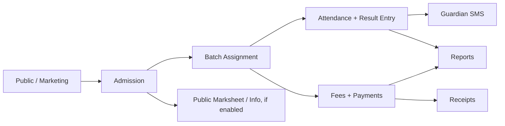

# Document 01 — System Overview

What LaraLMS is, who it is for, and how its pieces fit together — written for a non-technical reader.

## 1.1 Product Overview

LaraLMS is a web-based management system built for a coaching centre / private institute. It replaces the usual mix of registers, spreadsheets, and paper receipts with one system that an Admin, a Batch Director (teacher-in-charge of a class), and a Student each log into with their own view of the same data.

At its core, LaraLMS keeps a single, always-current record of every student — who they are, which course and batch they belong to, what they owe and have paid, their attendance, and their exam results — and lets the right people see and edit the right slice of that record.

## 1.2 Target Users

- **Admin** — Runs the centre day to day: admission, fees, batches, staff, results, reports, settings. The first Admin account (the "Super Admin") has extra authority over other Admin accounts — see Document 04.
- **Batch Director** — A teacher/coordinator in charge of one or more batches: takes attendance, enters marks, sends result SMS to guardians.
- **Student** — Views their own profile, attendance, results, and payment history through a read-only portal, and can complete the parts of their own profile (address, guardian details, HSC/SSC background) the office doesn't fill in.
- **Public visitor** — Anyone with a browser, no login — can look up basic student info or a published exam result if the Admin has switched that on (see the User Manual's Public Pages section).

## 1.3 Main Capabilities

- Admission (single-entry and bulk Excel), with an auto-generated permanent Registration ID kept separate from the admin-entered Roll Number.
- Course / Batch / Session academic structure, with Batch Director assignment.
- Fee & payment tracking with printable receipts, and coaching-material (books/sheets) stock and distribution.
- Attendance and exam-result entry, with automatic guardian SMS on result.
- A separate Admission Result module for matching board/HSC admission outcomes against the coaching's own students.
- Reporting (admission, fee collection, due, attendance, result, material, staff, branch ledger), all printable and exportable.
- A public, no-login information/marksheet lookup the Admin can enable or disable at will.
- Role-based access with a granular, per-Admin module on/off switch (see Document 04).

## 1.4 System Architecture

LaraLMS is a standard modern web application split into two independent parts that talk to each other only over a REST API — there is no direct database access from the browser.

| Layer | Technology | Role |
|---|---|---|
| Frontend | React 18 + Vite + TypeScript, Tailwind CSS | Everything rendered in the browser — every page, form, table, and dialog described in this package. |
| Backend | Node.js + Express + TypeScript | The REST API — validates every request, applies business rules, and is the only thing that talks to the database. |
| Database | MongoDB + Mongoose | Stores every record — students, staff, payments, results, settings, etc. |
| Authentication | JWT (JSON Web Tokens) + bcrypt | Issues short-lived login tokens; passwords are one-way hashed, never stored or shown in plain text. |

The frontend never decides what a user is allowed to do on its own — it only *hides* things the API would reject anyway. The real decision is always made on the server, on every single request. This matters for a client to understand: even if someone tampered with the browser, the server would still refuse anything outside their role.

## 1.5 Authentication & Permission Architecture

LaraLMS uses **three different login methods**, one per audience — this is a deliberate design choice, not three unfinished systems:

| Who | Logs in with | Session length |
|---|---|---|
| Admin | Mobile number + password | Short-lived token (15 min) silently renewed via a secure refresh cookie for up to 30 days |
| Batch Director / other Staff | Mobile number + their Staff ID (no password) | 12-hour token; no renewal — a Staff Portal login is a simple "does this phone+ID pair match a real staff record" check, nothing is stored per-session |
| Student | Mobile number + current Roll Number (no password) | Same 12-hour, no-renewal pattern as Staff |

Permissions are built from a fixed catalogue of "module:action" keys (e.g. `students:read`, `payments:create`). An Admin holds every key by default; a Batch Director or Student holds a fixed, smaller set scoped to their own batch or their own record. On top of this, an individual Admin's access can be **narrowed module-by-module** at the moment they're created or edited — see Document 04.

> **Super Admin.** The very first Admin account (created by the system's initial setup) is flagged as the Super Admin. Only this account can edit another Admin's details, reset an Admin's password, or delete an Admin account — a safeguard so no single compromised or careless Admin login can take over another Admin's account. Every Admin, including regular ones, can still create new Admins.

> **Forced password change.** If an account is created or its credentials are reset without an explicit password being set (including the initial seeded Super Admin account), the backend marks that login as requiring a password change on next use. As of v1.1, the app enforces this: the user is shown a full-screen "set a new password" prompt before they can use anything else, and any user can also change their own password voluntarily from the Topbar user menu at any time. See Document 08 for why this matters for go-live.

## 1.6 High-Level Workflow

