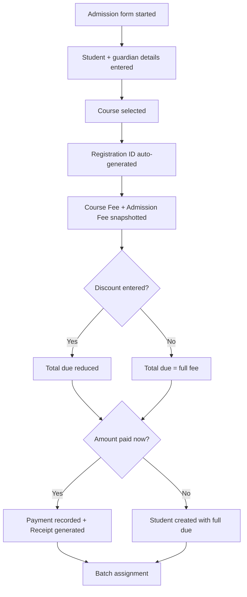
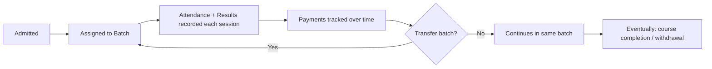
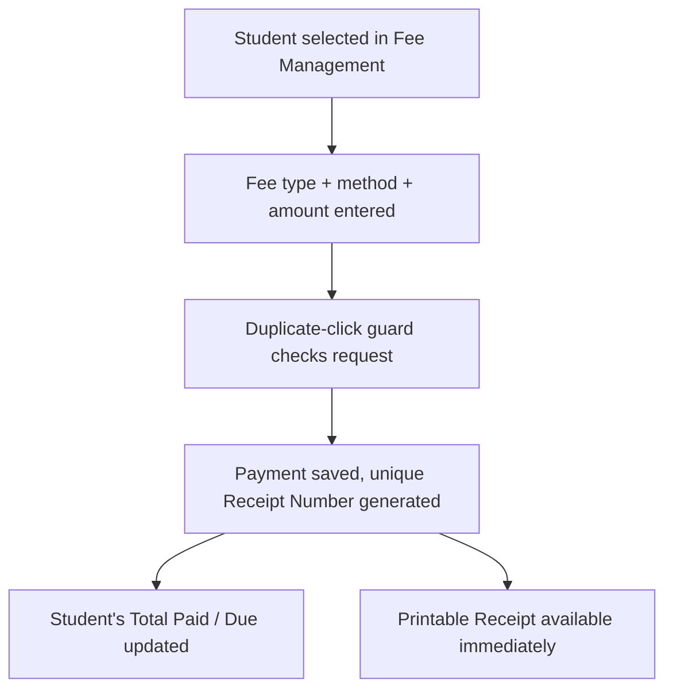
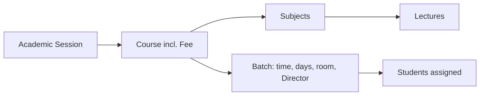
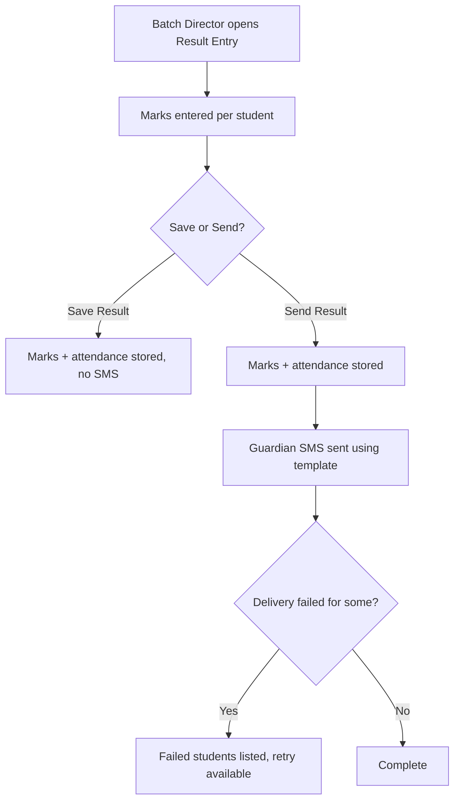
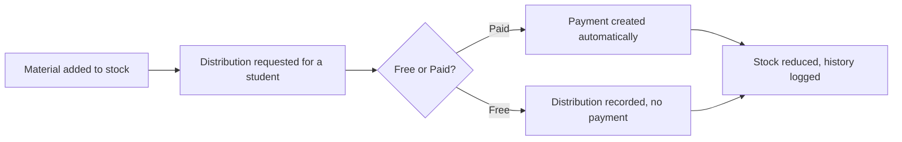
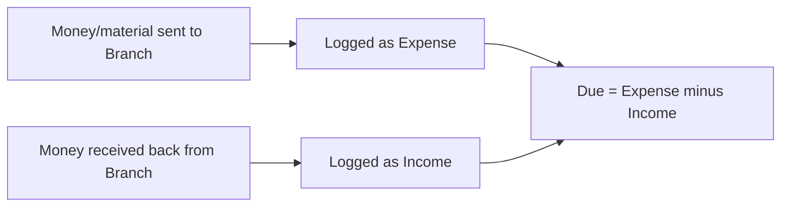
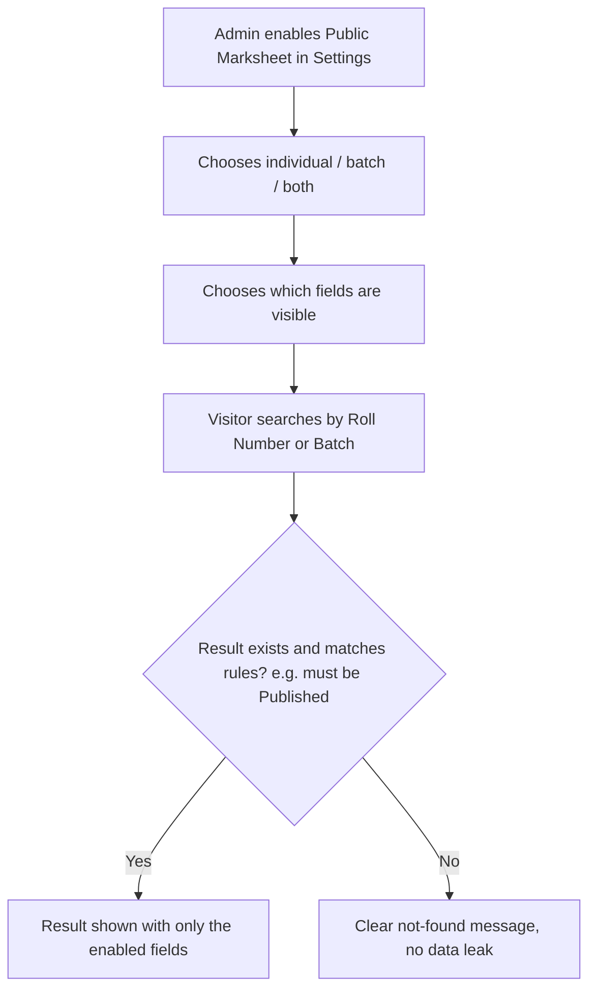
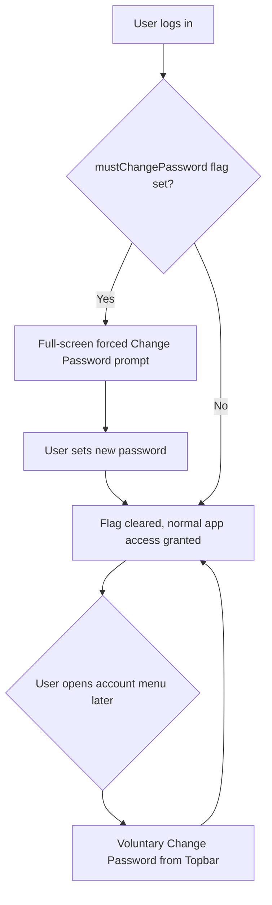

# Document 05 — Business Workflows

The same processes as Document 03, shown as flow diagrams for a quick, whole-picture read.

## 5.1 Admission Workflow

## 5.2 Student Lifecycle

## 5.3 Payment Workflow

## 5.4 Course → Batch → Student Workflow

## 5.5 Academic Workflow

## 5.6 Result & SMS Workflow

## 5.7 Material Distribution Workflow

## 5.8 Branch Ledger Workflow

## 5.9 Public Result Workflow

## 5.10 Password Change / Forced Reset Workflow (added v1.1)

